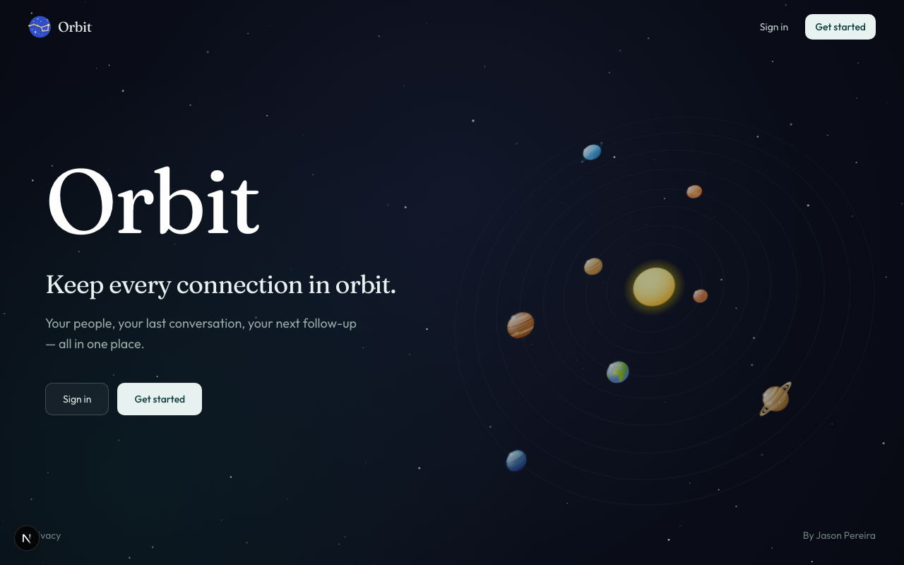
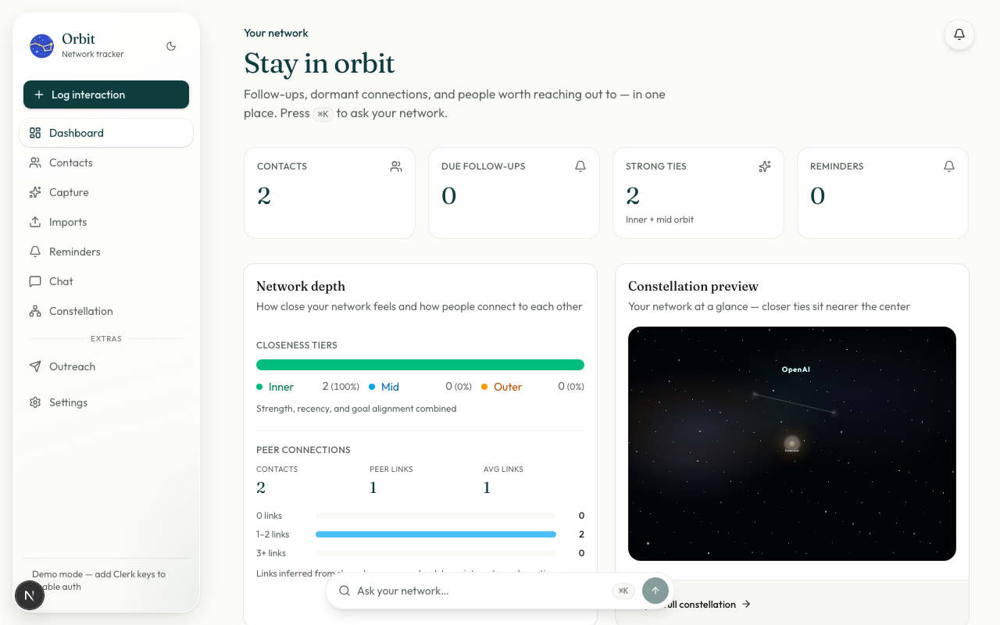
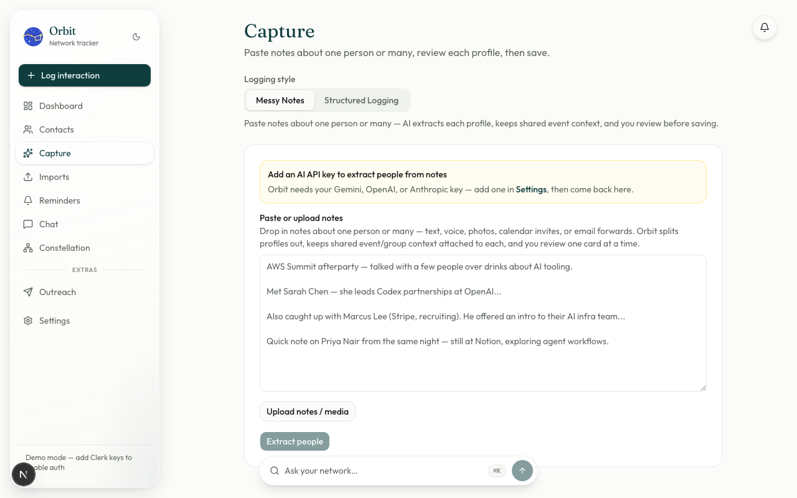
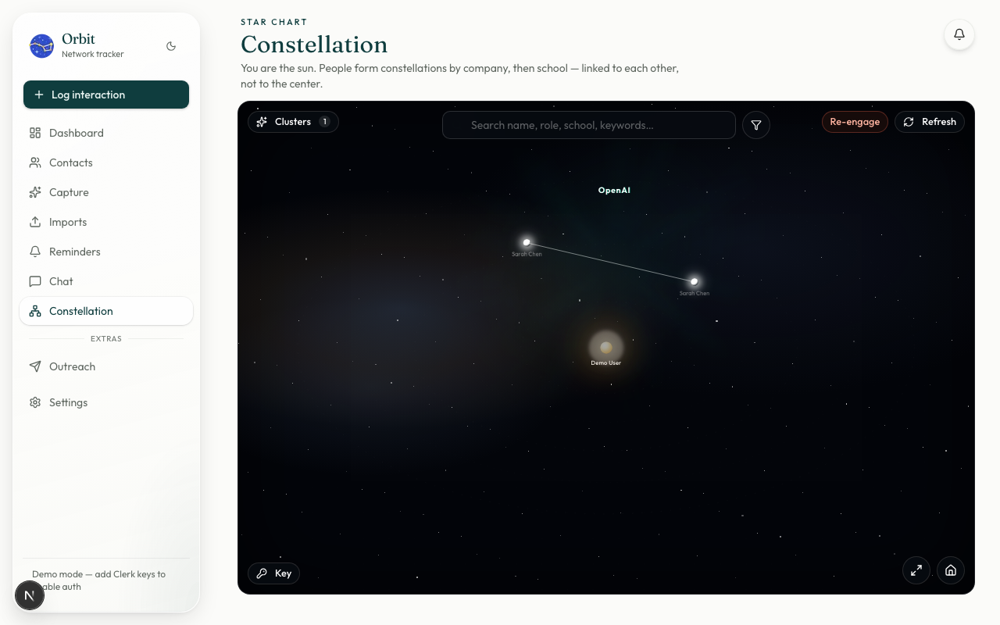
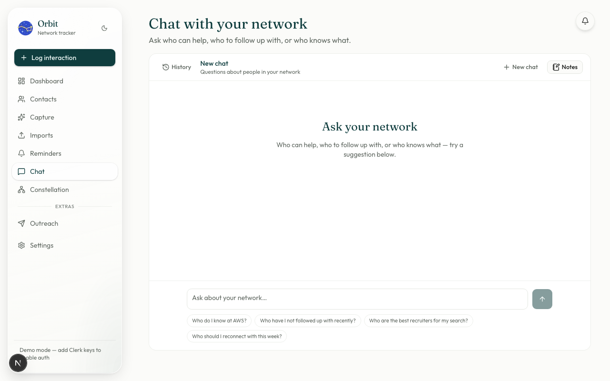

<p align="center">
  
</p>

<h1 align="center">Orbit</h1>

<p align="center">
  Keep every connection in orbit.<br/>
  Your people, your last conversation, your next follow-up — all in one place.
</p>

<p align="center">
  
  
  
</p>

## What is Orbit?

Orbit is a personal networking CRM — a private, structured memory for every relationship in your professional life. It turns messy conference notes, LinkedIn exports, message history, and one-off "let's stay in touch"s into a searchable database you can actually act on, instead of a pile of business cards and forgotten DMs.

Paste in notes from a coffee chat and Orbit uses AI to pull out who you talked to, where you met, what you discussed, and when to follow up. Import your LinkedIn connections and messages, subscribe to a calendar, or connect Gmail, and Orbit folds that history in too. Then you can search it, browse it as a follow-up dashboard, or just ask it questions in plain English — *"who do I know at OpenAI?"*, *"who haven't I followed up with recently?"*, *"who should I reconnect with this week?"*

### Why it exists

Networking is valuable but the record of it is scattered — LinkedIn, Gmail, a notes app, a spreadsheet, your memory. That scatter is why people forget who they talked to, miss follow-ups, lose context before a call, and underuse a network they already built. Orbit exists to make that record structured, searchable, and actionable, so a real conversation turns into a real relationship instead of a vague memory. It started as a way to track people met at conferences, recruiter conversations, and investor/mentor relationships while job hunting and building — the kind of relationships that matter but are the easiest to lose track of.

## Screenshots

| | |
|---|---|
| **Landing** | **Dashboard** |
|  |  |
| **Capture — AI note extraction** | **Constellation — network map** |
|  |  |
| **Chat with your network** | |
|  | |

## Features

- **Capture** — paste raw notes (one person or many), let AI pull out contacts, companies, and context, review, then save
- **Contacts** — searchable list + profiles, relationship strength, recruiter tracking
- **Dashboard** — follow-ups, dormant connections, and suggestions in one view
- **Chat** — ask natural-language questions about who's in your network and who can help
- **Constellation** — an interactive star-chart of your network, clustered by company and school
- **Imports** — LinkedIn CSV/message exports, calendar ICS subscribe/upload, Gmail inbox (recruiter threads)
- **Outreach** — search prospects (via Apollo) and send tracked email/SMS campaigns
- **Knowledge base** — everything Orbit has learned about your network from notes, imports, and summaries in one searchable place
- **Reminders** — timed follow-up nudges so no relationship goes cold
- **Settings** — bring your own AI key (Gemini/OpenAI/Anthropic), export your data, delete your data

## Stack

- Next.js (App Router) + TypeScript + Tailwind + shadcn/ui
- Clerk auth (optional — demo mode without keys)
- Neon Postgres **or** local on-disk PGlite (`.data/pglite` when `DATABASE_URL` is unset)
- Google Gemini (`@google/genai`), OpenAI, and Anthropic for note parsing, chat, and embeddings (BYOK in Settings, or server-side keys)
- React Flow for the network graph

## How to use it

### 1. Get it running

```bash
cp .env.example .env.local
npm install
npm run db:setup   # create tables (Neon via DATABASE_URL, or local PGlite)
npm run dev
```

Open [http://localhost:3000](http://localhost:3000) (or the port Next prints if 3000 is taken).

Without Clerk keys, the app runs as `demo-user` in development only — no sign-up needed to try it locally. Add a Gemini, OpenAI, or Anthropic API key in **Settings** (or the matching env var) before using Capture / Chat, since those features are AI-powered.

Optional demo contact, so the dashboard isn't empty on first look:

```bash
npm run db:seed
```

Restart `npm run dev` afterward if the server was already running, so it reloads the shared PGlite database.

### 2. Walk through it

1. **Settings** → add an AI API key (Gemini, OpenAI, or Anthropic)
2. **Capture** → paste notes from a real conversation → review the AI-extracted profile → save
3. **Dashboard** → see who's due for a follow-up and how your network breaks down
4. **Chat** → ask "Who should I talk to about AI-assisted development?"
5. **Constellation** → see your network laid out as a star chart, clustered by company/school
6. **Imports** → bring in a LinkedIn export or connect Gmail so Orbit has real history to work with

### Database

| Command | Purpose |
|---|---|
| `npm run db:setup` | Bootstrap schema + verify read/write |
| `npm run db:push` | Sync Drizzle schema to `DATABASE_URL` (Postgres/Neon) |
| `npm run db:generate` | Generate SQL migrations under `drizzle/` |
| `npm run db:seed` | Insert a sample contact for `demo-user` |

Leave `DATABASE_URL` unset to use on-disk PGlite (`.data/pglite`). Set it to a Neon/Postgres URL for remote data.

### Env vars

| Variable | Purpose |
|---|---|
| `DATABASE_URL` | Neon/Postgres connection (omit to use local `.data/pglite`) |
| `NEXT_PUBLIC_CLERK_PUBLISHABLE_KEY` / `CLERK_SECRET_KEY` | Auth |
| `CLERK_WEBHOOK_SIGNING_SECRET` | Clerk webhooks (`user.created` / `user.deleted`) |
| `GEMINI_API_KEY` / `OPENAI_API_KEY` / `ANTHROPIC_API_KEY` | Server-side AI (or add a key in Settings) |
| `ENCRYPTION_SECRET` | Encrypts user BYOK keys at rest |
| `MICROLINK_API_KEY` | Optional — higher LinkedIn photo lookup quota |
| `GOOGLE_CLIENT_ID` / `GOOGLE_CLIENT_SECRET` / `GOOGLE_REDIRECT_URI` | Optional — Gmail import (recruiter inbox) |

A few features also read credentials that aren't in `.env.example` yet: an **Apollo** API key for live outreach prospect search (falls back to demo results without one), and **Resend**/**Twilio** credentials for sending outreach email/SMS.

## App surfaces

| Route | Purpose |
|---|---|
| `/` | Marketing landing |
| `/dashboard` | Follow-ups, suggestions, recent contacts |
| `/onboarding` | First-run tutorial — add or import your first people |
| `/contacts` | Searchable contact list + profiles |
| `/recruiters` | Recruiter tracking, linked from Contacts |
| `/capture` | Paste notes → AI extract → review → save |
| `/imports` | LinkedIn connections + messages, calendar ICS, Gmail |
| `/chat` | Ask who in your network can help |
| `/graph` | Constellation — interactive network map |
| `/knowledge` | Searchable knowledge base built from notes, imports, and summaries |
| `/outreach` | Prospect search (Apollo) + tracked email/SMS campaigns |
| `/reminders` | Follow-up reminders |
| `/settings` | BYOK, export, delete data |

## License

MIT — see [LICENSE](LICENSE).

Product spec: [docs/orbit_networking_tracker_spec.md](docs/orbit_networking_tracker_spec.md)
