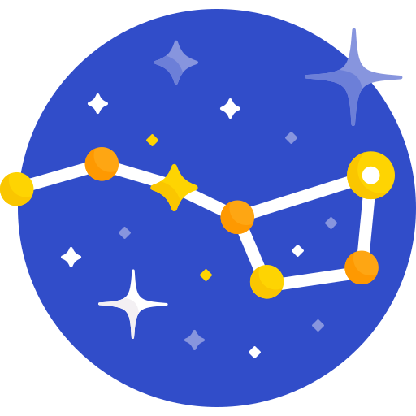
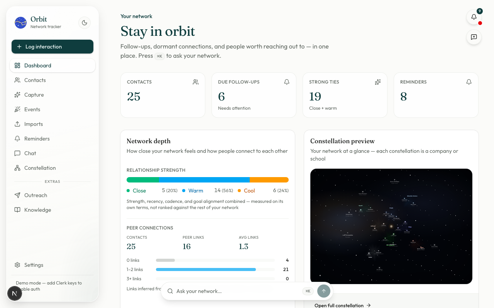
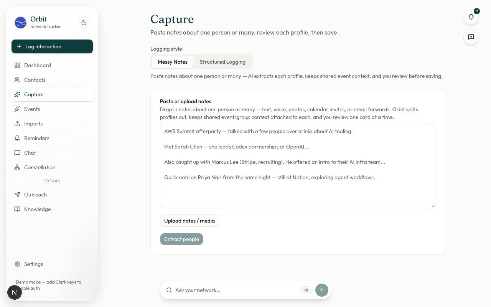
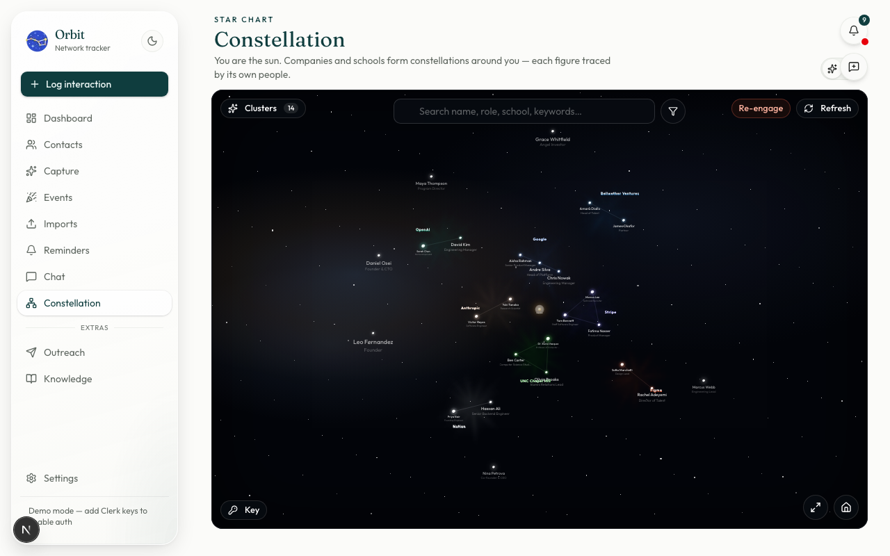
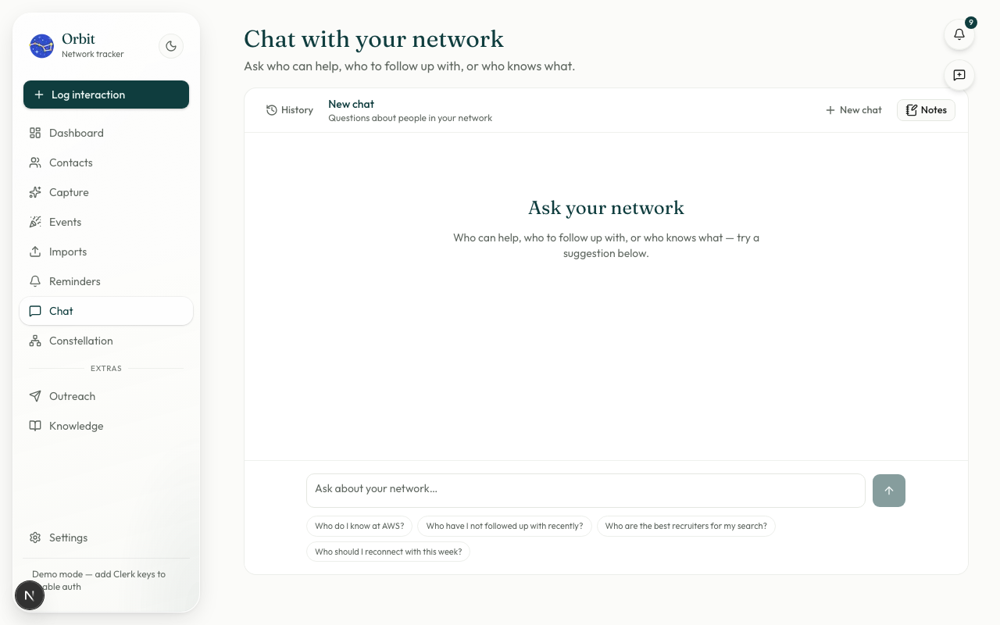

  

<h1 align="center">Orbit</h1>

  <strong>Keep every connection in orbit.</strong> 
  Orbit remembers every conversation and tells you who to follow up with, 
  so a good connection doesn't go cold before it becomes an opportunity.

  <a href="https://myorbitnetwork.com"><strong>Join the waitlist →</strong></a> 
  Private beta. Invitations go out in waves.

  

---

## The problem

Your network is probably your most valuable asset, and you have no system for keeping it.

- **Context is scattered.** Who someone is, how you met, and what you promised are spread across notes apps, LinkedIn, your inbox, your calendar, and your memory.
- **Follow-ups slip.** A warm intro goes cold because nothing reminded you. By the time you remember, the moment has passed.
- **You don't know who you know.** You probably already know someone at the company you're pitching or applying to, but you can't search your own network to find out.
- **CRMs are built for sales teams.** They assume pipelines, seats, and hours of data entry. Spreadsheets and notes apps never nudge you.

**Orbit is a CRM for one person.** Adding someone takes seconds, and then Orbit does the work of keeping the relationship warm.

## How it works

| | |
|---|---|
| **Capture** | Paste messy notes, record a voice memo, snap a business card, or bring in the contacts you already have. Orbit finds the people and the context. |
| **Remember** | Every person gets a profile with a timeline of every interaction and a short brief on who they are to you. |
| **Nudge** | Orbit tracks who's due a follow-up and who's going cold, then puts it on one screen. |
| **Act** | Ask your network questions, get suggested reminders and drafted messages, and reach out while the moment is still warm. |

## A look inside

| | |
|---|---|
| **Your relationships at a glance** | **Capture people from messy notes** |
|  |  |
| **See your whole network as a constellation** | **Ask your network anything** |
|  |  |

## What you can do

- **Capture from whatever you have.** Notes about one person or a whole conference, voice memos, business card photos, a folder of meeting notes, or a live meeting transcribed into people, decisions, and action items. You review each person in one card before anything is saved.
- **Know everyone's story.** Searchable profiles with how close you are, every interaction, follow-ups, and a short brief to read before you meet.
- **Never miss a follow-up.** A home screen that shows who's due, who's going cold, and what to say. Reminders repeat, snooze, and appear in your Google, Apple, or Outlook calendar.
- **Ask your network.** *"Who do I know at Stripe?"* *"Who should I talk to about raising a seed round?"* Answers come from your own contacts and notes.
- **See the shape of your network.** An interactive star chart clustered by company and school, with your closest ties shining brightest.
- **Bring your people with you.** Import LinkedIn connections and messages, address books, Google and Outlook contacts, your calendar, and notes from Google Drive. Every import can be undone.

### Works where you already are

- **Inside Claude and ChatGPT.** Connect Orbit and ask about your network from the assistant you already use. It's free on every plan.
- **In your browser.** A Chrome side panel on LinkedIn, Gmail, and anywhere else a person shows up. It tells you whether you already know them, what you know, and what to say.

## Why Orbit

1. **Built for messy input.** Other CRMs need clean data entry. Orbit starts from the notes you actually take.
2. **It tells you what to do next.** Orbit gives you a daily to-do list for your relationships, not just a database.
3. **Your AI, your choice.** Bring your own Gemini, OpenAI, or Anthropic key on any plan, or use the AI included with Pro and Max.
4. **You stay in control.** Orbit never sends anything without your approval, including messages an assistant drafts for you.
5. **Personal, not corporate.** It's designed to feel like your own sky, not like enterprise software.

## Pricing

| | **Free** | **Orbit Pro** | **Orbit Max** |
|---|---|---|---|
| **Price** | $0 forever | $8.99/month or $89.99/year | $19.99/month or $199.99/year |
| **Contacts** | Up to 500 | Unlimited | Unlimited |
| **AI** | Your own key | Included: 200 credits a month | Included: 500 credits a month |
| **Capture, Chat, Constellation, Knowledge, reminders, LinkedIn import, export** | ✓ | ✓ | ✓ |
| **Claude and ChatGPT connector** | ✓ | ✓ | ✓ |
| **Google and Microsoft accounts** | One of the two | Both | Both |
| **Recruiter tracking, calendar subscriptions** | | ✓ | ✓ |
| **Voice notes** | 1 hour a month | 5 hours a month | 10 hours a month |
| **Meeting transcription** | | 5 hours a month | 10 hours a month |
| **Contact enrichment** | | 10 a month | 25 a month |
| **REST API and webhooks** | | | ✓ |

Free: bring your own AI key. Pro and Max: AI included, with $5 packs of 250 credits if you ever need more, and nothing charged automatically. A year paid up front is two months free. Hitting a limit only stops you adding new contacts. Orbit never hides or deletes your data.

## Trust and privacy

- **Your network is yours.** Orbit never trains on your data and never sells it.
- **Export any time.** Download everything Orbit knows, whenever you want.
- **Deletion means deletion.** Delete one category or your whole account, and it's gone.
- **Secrets stay secret.** Your AI keys and account connections are encrypted at rest.
- **Nothing goes out without you.** Every message, whether you drafted it, Orbit suggested it, or an assistant wrote it, waits for your approval.

## Coming soon

- **Events.** Remember the conferences and meetups you went to and the people you met there.
- **Radar.** Every night, Orbit looks over your network and tells you who is worth a message this week, and why.

---

  <a href="https://myorbitnetwork.com"><strong>Join the waitlist →</strong></a>

MIT licensed. See <a href="LICENSE">LICENSE</a>.

