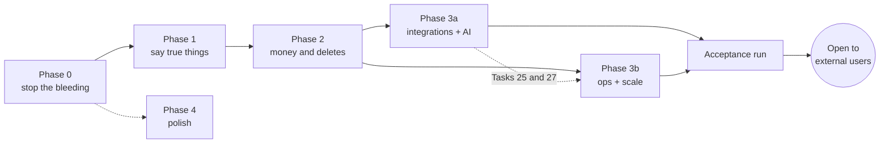

# Launch Readiness Roadmap

> **For agentic workers:** this is the index, not a task list. Execute the phase plans it links, in order, each with superpowers:subagent-driven-development (recommended) or superpowers:executing-plans. Do the "Manual steps" of each phase alongside its code; they are part of the phase's gate.

**Goal:** take Orbit from "not ready, but close" (audit of 2026-09-15) to safe for external, paying users, with every audit finding either fixed, verified, or written down as an accepted risk.

**Spec:** [docs/production-readiness-audit-2026-09-15.md](../../production-readiness-audit-2026-09-15.md). Every item id below (A1…A11, B1…B14, C1…C8) is a finding in that report.

**Supersedes:** the open items of [2026-09-10-production-readiness.md](2026-09-10-production-readiness.md). Its finished items (migration lease, daily backup schedule, dashboard bounding, `statement_timeout` probe) stay done; its open ones are carried into the phases below.

---

## What "fully ready" means

Orbit is ready for external users when all of these are true. Each has a way to check it.

| # | Criterion | How it is checked |
|---|---|---|
| R1 | A backup from the last 24 hours exists, and a restore was performed and timed within the last 30 days | GitHub → Actions → `backup` green; the drill table in `docs/RUNBOOK.md` has a dated row |
| R2 | Deleting an account leaves zero rows for that user in every table, revokes Google grants, and deletes the Clerk user | Acceptance run step 9 (SQL below) |
| R3 | The privacy policy and terms describe what the code does, including the Google Limited Use statement, and a lawyer or review service has read them | Phase 1 gate; Google OAuth verification submitted |
| R4 | Money is correct in every order of events: a paid user is never stuck on free, a refund or lost dispute revokes access, a late or duplicated webhook changes nothing | Phase 2 smoke suite plus acceptance run step 7 |
| R5 | No cross-tenant read or write exists on any route handler or server action | Phase 0 fixes plus the authz re-sweep in the acceptance run |
| R6 | A user's AI key cannot be spent without their knowledge: every background model call is capped, estimated up front, and visible in Settings | Phases 1 and 3a |
| R7 | Every known failure mode reaches a person: backup, purge, sync lag, webhook drain, backfill, Stripe attribution, Slack itself | Phase 3b; `/admin/health` shows each condition's state |
| R8 | A rollback is boring: promoting the previous deployment keeps health green and the scheduler running | Phase 0; acceptance run step 11 |
| R9 | The five core flows pass in a real browser on every PR | Phase 3b Playwright job required on `main` |
| R10 | The platform permits it: Vercel Pro (commercial use) | Manual decision D1 |
| R11 | A subscriber can cancel online without writing to anyone | Phase 2 Task 18; acceptance run step 7 |

---

## Phases

| Phase | Plan | Audit items | Effort | Schema bump | Must finish before |
|---|---|---|---|---|---|
| 0 — Stop the bleeding | [launch-p0-stop-the-bleeding](2026-09-15-launch-p0-stop-the-bleeding.md) (18 tasks) | A1 code, A2, A4, A5, A7, A8 short-term, A9, A11 code, B1, B8 model id, B11 dev logging, B12 admin delete | ~3 days | **None** (merges past the open branches holding 56) | the first external user |
| 1 — Say true things | [launch-p1-say-true-things](2026-09-15-launch-p1-say-true-things.md) (17 tasks) | A3, A6, B4, B5 scopes, B8 usage card, B9 (incl. a terms notice for existing accounts) | ~3.5 days + legal read | One | anyone pays |
| 2 — Trust the money and the deletes | [launch-p2-money-and-deletes](2026-09-15-launch-p2-money-and-deletes.md) (18 tasks) | A8 properly, B2, B3, B10, self-serve cancel (Stripe customer portal) | ~4.5 days | One | anyone pays |
| 3a — Integrations and AI reliability | [launch-p3a-integrations-and-ai](2026-09-15-launch-p3a-integrations-and-ai.md) (23 tasks) | B5 rest, B8 rest, B14, a verified sender for users' own Resend keys | ~5 days | One (`embedding_failures` table) | opening sign-up publicly |
| 3b — Operations, migrations, scale | [launch-p3b-ops-and-scale](2026-09-15-launch-p3b-ops-and-scale.md) (28 tasks) | B6, B7, B11 rest, B13, `backup.stale`, Phase 3a's ops conditions | ~5 days | None (`schema_migrations.fingerprint` is runtime-managed) | opening sign-up publicly |
| 4 — Polish | [launch-p4-polish](2026-09-15-launch-p4-polish.md) (17 tasks) | C1–C8 and low-severity leftovers | ~3 days | One (data-only: hash feed tokens, tag AI-derived rows) | — (any time after Phase 0) |



**Why this order.** Phase 0 is everything that harms a user today and can ship without a schema change, so it merges while three open branches still fight over version 56. Phase 1 makes the public promises true before anyone relies on them, and has to precede Google's OAuth verification, which takes weeks. Phase 2 depends on Phase 1's account-deletion action and Phase 0's refund logic. Phases 3a and 3b touch disjoint files by design and run in parallel, except that 3b's Tasks 25 and 27 read 3a's `embedding_failures` table, `quota` error kind and new rate-limit buckets: merge 3a into the 3b branch before those two tasks, or leave them for last. Phase 4 is independent after Phase 0.

**Invited beta.** A small group of people you know can start after Phase 0 plus the Manual steps of Phase 0, if you tell them it is a beta and turn Stripe checkout off (`STRIPE_LIFETIME_PRICE_ID` and the Pro ids unset hide both buttons). Nobody pays before Phase 2's gate.

---

## Where the plans touch each other

The phase plans were written in parallel against `33a213c`, so each later plan anchors its edits on quoted code rather than line numbers and says what to do if an earlier phase changed the text. These are the overlaps that need a decision, all already resolved in the plans:

- **Recruiter contact details.** Phase 0 Task 8 ships an interim, column-free rule (a row's creator is the link made within 120 s of it). Phase 2 Task 14 replaces it with per-link columns, uses the same 120 s window for its one-time backfill, deletes Phase 0's helpers, and rewrites `scripts/smoke-recruiter-pii.ts` rather than creating it.
- **Account deletion.** Phase 0 Task 1 (webhook, `scripts/smoke-account-deletion.ts`) and Phase 1 Task 8 (Settings "Delete my account", `scripts/smoke-delete-my-account.ts`) are separate paths with separate specs. Phase 1's also cancels a live Stripe subscription before deleting.
- **Rollback semantics.** Phase 0 Task 6 makes "recorded version ahead of the code" healthy and never downgrades it. Phase 3b Task 11 adds a DDL fingerprint and keeps that rule: ahead is current, equal needs a matching fingerprint.
- **Stripe mirror.** Phase 0 Tasks 2–3 add refund and dispute revocations; Phase 2 Task 2 moves every mirror variant into one `switch` with a `never` check, so an unported Phase 0 branch fails typecheck.
- **Playwright's AI stub.** Phase 3b points `GOOGLE_GEMINI_BASE_URL` at a local stub. Phase 3a must keep constructing the Gemini client without its own base URL (it does), and it deliberately does not set `retryOptions` — in `@google/genai` 2.12.0 the SDK does not retry by default, and turning retries on would replace provider error bodies the Phase 0 classifier reads.
- **Ops conditions.** Phase 3a's "Handoff to 3b" section lists the conditions its features need; Phase 3b implements them, plus `backup.stale` via a second Better Stack heartbeat (deferred from Phase 0).
- **Calendar feed tokens.** Phase 4 hashes stored tokens in place. After its migration runs, promoting a build from before Phase 4 Task 15 breaks existing feed URLs until users regenerate them; say so in the release note and do not roll back past it casually.
- **Phase 4 timing.** It can start after Phase 0, but Task 11 rewrites the recruiter sharing copy (Phase 2 Task 14 changes what is shared) and Task 16 edits the timeline backfill (Phase 1 Tasks 9–11 change it). Run Phase 4 after Phase 2 to write those two once; if it goes earlier, re-read both files before those tasks.
- **Shared files.** `scripts/run-smoke.ts` (MANIFEST), `src/lib/error-events.ts` (`ERROR_SOURCES`), `src/lib/ops-alerts.ts`, `src/app/api/imports/process-stalled/route.ts` and `docs/RUNBOOK.md` gain entries in several phases. Conflicts there are additive; keep both sides.

---

## Rules that apply to every phase

These are repeated in each plan's Global Constraints; they are here so the ordering reasons are in one place.

1. **Schema version numbers are computed, never planned.** Version 56 is claimed by three open branches (`claude/calendar-contact-enrichment-6e5bbd`, `claude/outreach-redesign-campaigns-48b9fc`, `codex/outreach-redesign`). At the moment of a bump, take one more than the highest `export const SCHEMA_VERSION` on any remote branch, and re-scan immediately before pushing:

   ```bash
   git fetch -q --all && for b in $(git for-each-ref --format='%(refname:short)' refs/remotes/origin); do git show "${b}:src/db/index.ts" 2>/dev/null | grep -oE 'export const SCHEMA_VERSION = [0-9]+'; done | grep -oE '[0-9]+$' | sort -n | tail -1
   ```

   After merging `main` into a phase branch that brought in DDL, bump again (the branch's own number is stale on every database a pre-merge build stamped).
2. **One branch and one PR per phase**, cut from `origin/main` after the previous phase merged, in a fresh worktree with its own `npm ci`. Before opening each PR, re-check `origin/main` for a rival implementation of the same fix (roughly sixty worktrees are active on this repo).
3. **CI must be green**: `typecheck · lint · build`, the smoke suite, the extension job, and from Phase 3b on the Playwright job. In GitHub → Settings → Branches → `main`, require all of them.
4. **Preview deploys run migrations against their own database.** Before Phase 1 (the first bump), confirm in Vercel that `DATABASE_URL` is scoped to Production only and previews use a Neon branch, and that `PRODUCTION_DB_HOST` is set on all environments (manual step M3). A preview that migrates production is the one mistake this roadmap cannot undo.

---

## Manual work that is not code

Grouped by where you do it. Each phase plan repeats the steps it depends on; this is the complete list.

### Decisions only you can make

| # | Decision | Recommendation | Why it matters |
|---|---|---|---|
| D1 | Upgrade Vercel to Pro ($20/month) — audit A10 | Yes, before the first paying stranger | Hobby forbids commercial use, and Pro removes three workarounds: one cron a day, one-hour logs, no queue |
| D2 | Neon paid tier for point-in-time restore | Yes once there are paying users | Daily dumps still leave up to 24 hours of writes unrecoverable |
| D3 | Buy an Apollo plan, or stop advertising "Contact enrichment on Orbit's credits" for Pro | Stop advertising it until there is demand | Production logs show the current key is a free plan that refuses the calls |
| D4 | Lawyer or privacy-review service for the rewritten policy | Yes | Google verification and GDPR exposure both rest on it |
| D5 | Timeline backfill default | Off, with an explicit opt-in and a cost estimate | Phase 1 builds it either way; the default is yours |
| D6 | Twilio opt-out handling | Enable Advanced Opt-Out on the number | Phase 3a decides the footer copy from your answer |

### GitHub

- **M1.** Settings → Secrets and variables → Actions: set `DATABASE_URL` (production Neon URL — the direct, unpooled host without `-pooler`, because `pg_dump` needs a session connection) and `BACKUP_AGE_PUBLIC_KEY` (`age-keygen -o backup-key.txt` locally, paste the `age1…` public line, store `backup-key.txt` in the password manager). Then Actions → backup → Run workflow and confirm an artifact appears. (A1)
- **M2.** Settings → Branches → `main`: require the CI checks listed in rule 3.

### Vercel

- **M3.** Environment Variables: `DATABASE_URL` scoped to Production only; previews on a Neon branch (the Neon integration does this); `PRODUCTION_DB_HOST` on all environments; `SLACK_OPS_WEBHOOK_URL`, `SLACK_OPS_CRITICAL_WEBHOOK_URL`, `BETTERSTACK_HEARTBEAT_URL`, `SENTRY_DSN`, `NEXT_PUBLIC_SENTRY_DSN`, `HEALTH_TOKEN` set; `RESEND_FROM_EMAIL` on a domain verified in Resend (A11).
- **M4.** After a week of quiet CSP reports, set `CSP_ENFORCE=1` and redeploy (it is read at build time). The query to check first:

  ```sql
  SELECT kind, count(*) FROM error_events
  WHERE source = 'csp.report' AND created_at > now() - interval '7 days'
  GROUP BY kind ORDER BY 2 DESC;
  ```
- **M5.** D1.

### Neon

- **M6.** As the app role: `ALTER ROLE <app_role> SET statement_timeout = '20s';` then confirm `GET /api/health?token=$HEALTH_TOKEN` reports `config.statementTimeout` as `20s`.
- **M7.** Note the point-in-time restore window under Project → Settings in the runbook.

### Stripe

- **M8.** Webhook endpoint subscribes to all ten events listed at the top of `src/app/api/webhooks/stripe/route.ts`. Set the business name (the sandbox shows "stripe-almond-grass"). Live price ids match the `STRIPE_*_PRICE_ID` variables. Configure the customer portal in both test and live mode (Settings → Billing → Customer portal: cancel at period end, update payment method, invoice history, links to `/terms` and `/privacy`) — Phase 2 Task 18's "Manage billing" button needs a saved configuration.

### Clerk

- **M9.** Enable "Require express legal consent" with links to `/terms` and `/privacy`; confirm the `user.deleted` and `user.created` webhooks are enabled and point at production.

### Google Cloud

- **M10.** After Phase 1 merges: update the consent screen's privacy-policy link, then submit OAuth verification for the restricted Gmail scopes with Phase 1's per-scope justification table. Verification takes weeks; until it passes, only listed test users can connect Gmail, so plan the beta list around it.

### Resend, Twilio, Apollo

- **M11.** Resend: verify the sending domain; create the webhook endpoint for bounces and complaints and set `RESEND_WEBHOOK_SECRET`. Tell users who bring their own Resend key that it must be a Full access key with a verified domain (Phase 3a Task 22 reads their domains).
- **M13.** Better Stack: a second heartbeat monitor for backups with a 36-hour period; put its URL in the GitHub secret `BETTERSTACK_BACKUP_HEARTBEAT_URL` (Phase 3b).
- **M12.** Twilio: D6. Apollo: D3.

---

## Acceptance run

Done once, after Phases 0–3 merge, on a preview deployment backed by its own Neon branch, with Clerk and Stripe in test mode. It closes every "could not test" item in audit section 6. Record the date and outcome of each step in the PR that flips the launch switch.

1. **Sign up** with a new email: consent checkbox shown, accepted terms recorded, onboarding tour, empty dashboard with the no-key notices. Then null `terms_version` on an existing test account and reload: the terms notice appears on every app page until **Accept**.
2. **Sign-in errors**: wrong password, unknown email, reset flow. Let a session expire (or delete the `__session` cookie), then ask a chat question: expect "You’re signed out — sign in again to keep chatting", not a spinner.
3. **Keys**: save a valid and an invalid key for each of Gemini, OpenAI and Anthropic; the invalid one is refused at save. Put a $1 budget on one provider, exhaust it, and confirm capture and chat say the account is out of credit.
4. **Capture and chat**: the Phase 4 fixture note produces three people, one update, the right reminder count; chat answers a company question with evidence.
5. **Google**: connect a throwaway account for contacts only and read the consent screen (contacts scope only); import. Connect for the recruiter scan and untick mail on the consent screen: expect the "didn’t grant mail access" message. Revoke the grant in Google's third-party access page and open Recruiters: expect "Session expired — reconnect".
6. **Imports**: a real LinkedIn connections export; a messages export with the timeline estimate shown and the opt-in off by default.
7. **Stripe** (with the Stripe CLI):
   ```bash
   stripe listen --forward-to <preview-url>/api/webhooks/stripe
   ```
   Buy Lifetime with forwarding stopped: the return URL grants the plan. Start forwarding: the late webhook is a no-op. Buy Pro, then cancel it yourself from Settings → **Manage billing** in Stripe's portal: the plan stays Pro until the period end and drops to Free after it. `stripe trigger customer.subscription.updated` for the cancelled subscription: no re-grant. Refund the Lifetime charge in the dashboard: access revoked.
8. **Disconnect Google** with "also delete what Orbit imported": the grant disappears from the Google account and the imported contacts are gone.
9. **Delete my account**, then prove zero rows. In the Neon SQL editor, generate and run the count query:
   ```sql
   SELECT string_agg(format('SELECT %L AS t, count(*) FROM %I WHERE user_id = %L', table_name, table_name, '<clerk_user_id>'), ' UNION ALL ')
   FROM information_schema.columns
   WHERE column_name = 'user_id' AND table_schema = 'public';
   ```
   Every count is zero, the Clerk user no longer exists, and `admin_audit_log` holds no email for them.
10. **Scale**: seed 10,000 contacts on the preview branch (`scripts/seed-scale.ts`), then time `/dashboard`, `/knowledge`, `/graph`, `/contacts/[id]` and `/chat`; each under 3 s TTFB, no function over 10 s in `perf.slow`. This is also where audit C4 (the chat route sitting on its skeleton for 30 s in dev) is settled: if `/chat` misses the target on the preview, profile its server render before launch; if it meets it, C4 was a dev-server artefact.
11. **Rollback**: point a preview built from the previous commit at a Neon branch stamped with the newer schema version; `/api/health` answers 200 `degraded`, not 503.
12. **Restore drill**: restore the newest backup into a fresh Neon branch, check row counts, record date and duration in the runbook (R1).
13. **Phones**: iPhone Safari (Simulator) and a mid-range Android Chrome on dashboard, capture, contacts, chat, settings; tap targets at least 44 px.
14. **Authz re-sweep**: re-run the authorization audit prompt from the audit session over the final `main` and confirm "no findings" or fix before launch.

---

## Accepted risks after launch

Written down so they stay decisions rather than surprises.

1. Up to 24 hours of writes are unrecoverable until D2 (Neon PITR).
2. Scheduled jobs run on GitHub Actions until D1 moves crons to Vercel; GitHub disables schedules after 60 idle days, detected by the Better Stack heartbeat (Phase 3b adds the runbook steps).
3. Free-text notes about a deleted contact are not scrubbed; the delete confirmation says so (Phase 2).
4. The CSP keeps `'unsafe-inline'` in `script-src` (nonce threading would force every marketing page dynamic).
5. Unavatar and Microlink quotas are shared across all users; Phase 3a caps each user's share but cannot raise the ceiling.
6. `scripts/demo-signin-link.ts` mints a sign-in link with the Clerk secret key and writes no audit row. It is an operator script that needs production credentials; the privacy policy's "recorded with a reason" covers links minted in the console. Run it only for the showcase account.
7. A user's own Resend key restricted to Sending access cannot list domains, so Orbit refuses to send with it and asks for a Full access key.

---

## Tracking

| Phase | Branch | PR | Merged | Gate met |
|---|---|---|---|---|
| 0 | `claude/launch-p0` | | | |
| 1 | `claude/launch-p1` | | | |
| 2 | `claude/launch-p2` | | | |
| 3a | `claude/launch-p3a` | | | |
| 3b | `claude/launch-p3b` | | | |
| 4 | `claude/launch-p4` | | | |
| Acceptance run | — | | | |
